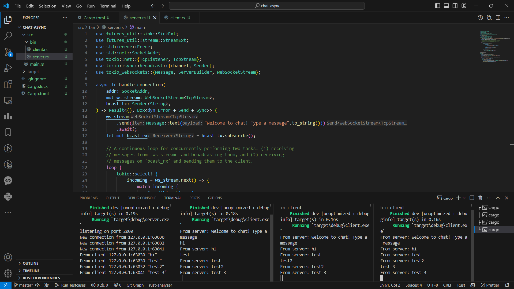
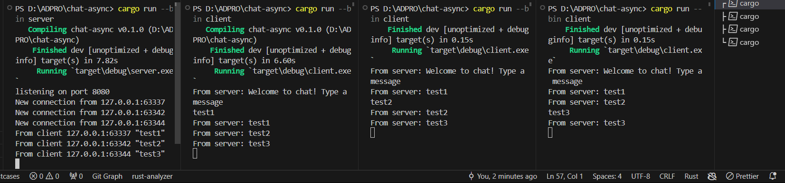

## Experiment 2.1

`cargo run --bin server` to run the server and `cargo run --bin client` to run the clients. When I type a message in a client terminal and press enter, the message is sent to the server. The server then broadcasts the message to all connected clients, including the one that sent the message.

## Experiment 2.2

In my `server.rs` file, I changed the line:
```rust
let listener = TcpListener::bind("127.0.0.1:2000").await?;
```
to:
```rust
let listener = TcpListener::bind("127.0.0.1:8080").await?;
```

In my `client.rs` file, I changed the line:
```rust
let (mut ws_stream, _) = ClientBuilder::from_uri(Uri::from_static("ws://127.0.0.1:2000"))
```
to:
```rust
let (mut ws_stream, _) = ClientBuilder::from_uri(Uri::from_static("ws://127.0.0.1:8080"))
```

Yes, both the server and client are using the same WebSocket protocol. This is defined by the `tokio_websockets` crate.